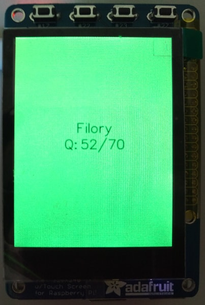

# Wifi Map for Raspberry Pi

Display Wifi link quality on the a Raspberry Pi screen. Color coded background, which goes from red (Q=0) to green (Q=70). Also displays access point SSID and quality (Q) value on the screen.

## Requirements

Hardware requirements to work with this code:

* Raspberry Pi
* PiTFT 2.8" screen

## Settings

A number of settings you can change through adjusting the environment variables,
either application-wide, or per-device:

* `INTERFACE`: which WiFi interface to monitor, default to `wlan0`
* `PERIOD`: update period in ms, default to `1000` (that is 1s), seem to work at last as low as `100` (0.1s)
* `DEBUG`: show WiFi interface scan results in the log, set it to `1` to show, default not to show
* `ROTATE`: rotate the screen with this many degrees, accepted values are 0, 90, 180, 270. Default is 0 (no rotation).

## License

Copyright 2016 Rulemotion Ltd.

Licensed under the Apache License, Version 2.0 (the "License");
you may not use this file except in compliance with the License.
You may obtain a copy of the License at

    http://www.apache.org/licenses/LICENSE-2.0

Unless required by applicable law or agreed to in writing, software
distributed under the License is distributed on an "AS IS" BASIS,
WITHOUT WARRANTIES OR CONDITIONS OF ANY KIND, either express or implied.
See the License for the specific language governing permissions and
limitations under the License.
